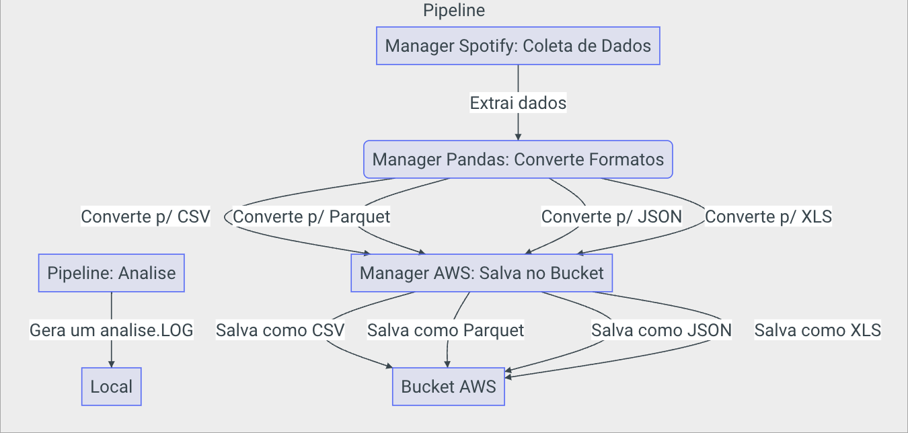
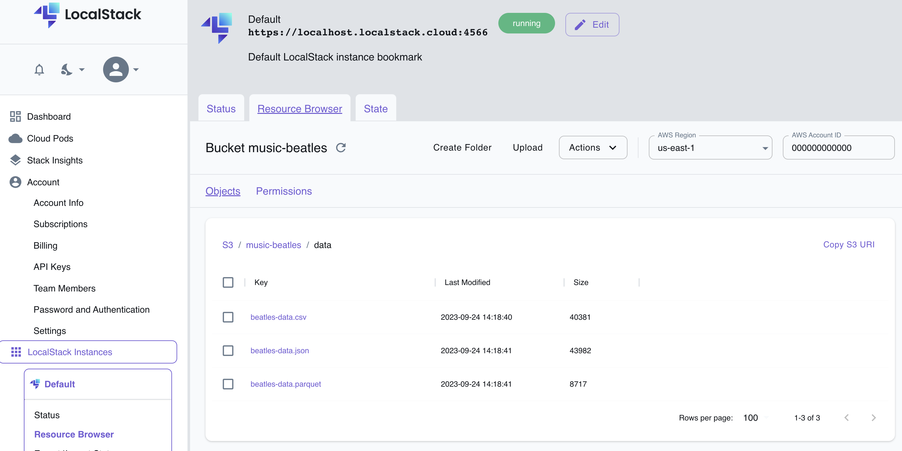
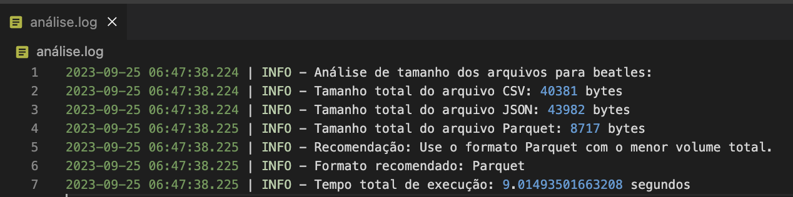

# Datalake Format Explorer

Este é um projeto de exemplo que demonstra um processo de ETL (Extração, Transformação e Carga) de dados usando Python, Polars e AWS LocalStack. Ele foi projetado para extrair informações de um artista musical do Spotify, transformar esses dados em diferentes formatos e carregá-los em um "datalake" local usando o LocalStack.

O objetivo final é fazer uma análise sobre os 3 tipos de arquivo gerado, CSV, Parquet e JSON, e verificar qual o melhor formato para armazenar os dados.

A análise final é salva em um arquivo do tipo LOG localmente

## Arquitetura simplificada



Alguns pontos interessantes:

- Substituição do `requests` pelo `httpx` para melhorar a performance da extração de dados.
- Uso do `Polars` para transformar os dados extraídos em diferentes formatos.
- Uso do `LocalStack` para simular um ambiente AWS localmente.

Apresenta um UI bem interessante



- Uso do `Docker Compose` para configurar o LocalStack e o ambiente de desenvolvimento.
- Uso do `Make` para automatizar a execução de tarefas comuns.
- Uso do `Mkdocs` para gerar a documentação do projeto.

## Documentação do projeto

[Mkdocs Page](https://lvgalvao.github.io/datalake-format-explorer/)

## Pré-requisitos

- Docker: [Instalação do Docker](https://docs.docker.com/get-docker/)
- Make (opcional, mas recomendado): [Instalação do Make](https://www.gnu.org/software/make/)
- Poetry: [Instalação do Poetry](https://python-poetry.org/docs/#installation)

## Como Executar

1. Clone este repositório:

   ```bash
   git clone https://github.com/lvgalvaofilho/datalake-format-explorer.git
    ```

2. Navegue até o diretório do projeto:

    ```bash
    cd datalake-format-explorer
    ```

3. Crie um arquivo `.env` na raiz do projeto com suas credenciais do Spotify:

    ```env
    SPOTIFY_CLIENT_ID=sua-chave-de-cliente
    SPOTIFY_CLIENT_SECRET=sua-chave-secreta
    ```

4. Instale as dependências do projeto com Poetry:

    ```bash
    poetry install
    ```

5. Ative o ambiente virtual do Poetry:

    ```bash
    poetry shell
    ```

6. Inicie o Docker Compose para configurar o LocalStack:

    ```bash
    docker-compose up
    ```

7. Execute a pipeline ETL com o Make, substituindo `"Nome do Artista"` pelo nome do artista que você deseja processar:

    ```bash
    make run artist="Nome do Artista"
    ```

    ```bash
    make run artist="Beatles"
    ```

    Certifique-se de usar aspas duplas ao redor do nome do artista se o nome tiver espaços.

8. Após a execução, os dados do artista serão extraídos, transformados em diferentes formatos (CSV, JSON e Parquet) e carregados em um "datalake" local.

9.  Os arquivos gerados podem ser encontrados na pasta `data` do projeto e também serão enviados para o LocalStack S3, onde você pode acessá-los usando as ferramentas do LocalStack.

10. É gerado um arquivo análise.log com o resultado da análise de tamanho dos arquivos gerados.


