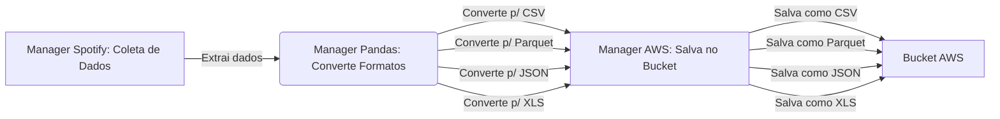

# Welcome to MkDocs

## Descrição

O projeto consiste em coletar dados de uma API do Spotify, transformar os dados em diferentes formatos e armazenar em um bucket na AWS.

## Fluxo

## Módulos

### ::: app.ETL.manager_spotify

### ::: app.ETL.manager_pandas

### ::: app.ETL.manager_aws
