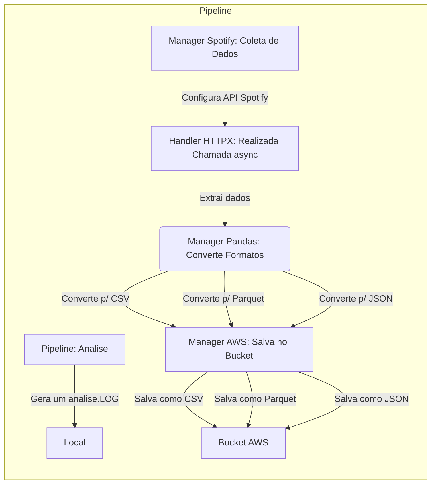

# Doc Datalake Format Explorer

## Descrição

O projeto consiste em coletar dados de uma API do Spotify, transformar os dados em diferentes formatos e armazenar em um bucket na AWS.

O objetivo final é fazer uma análise sobre os 3 tipos de arquivo gerado, CSV, Parquet e JSON, e verificar qual o melhor formato para armazenar os dados.

A análise final é salva em um arquivo do tipo LOG localmente

## Fluxo

## Módulo Handler HTTP

Esse módulo foi criado depois para "desempacotar" o httpx/requests da aplicação, assim, caso seja necessário trocar a biblioteca de requisições, basta alterar o módulo.

Classe HTTPRequest

### ::: app.ETL.handler_http.HTTPRequest

### ::: app.ETL.handler_http.make_http_request

## Módulos do manager_spotify

Esse módulo foi criado para encapsular as chamadas a API do Spotify, assim, caso seja necessário trocar o dominio, basta alterar o módulo.

### ::: app.ETL.manager_spotify.get_spotify_access_token

### ::: app.ETL.manager_spotify.search_artist

Retorna um objeto do tipo ArtistDetails

### ::: app.models.spotify_models.ArtistDetails

### ::: app.ETL.manager_spotify.get_artist_albums

Retorna um objeto do tipo TrackDetails

### ::: app.models.spotify_models.TrackDetails

### ::: app.ETL.manager_spotify.get_album_tracks

Retorna um objeto do tipo AlbumDetails

### ::: app.models.spotify_models.AlbumDetails

### ::: app.ETL.manager_spotify.get_all_artist_details

Retorna um objeto do tipo CompleteArtistDetails

### ::: app.models.spotify_models.CompleteArtistDetails

## Módulos do manager_polars

Esse módulo foi criado para encapsular as chamadas a API do Pandas e Polars, assim, caso seja necessário trocar a biblioteca de manipulação de dados, basta alterar o módulo.

### ::: app.ETL.manager_polars.save_data_to_formats

## Módulos do manager_aws

Esse módulo foi criado para encapsular as chamadas a API do AWS, assim, caso seja necessário trocar o provedor de armazenamento, basta alterar o módulo.

### ::: app.ETL.manager_aws.create_bucket

### ::: app.ETL.manager_aws.upload_to_s3

## Módulos de análise

Esse módulo foi criado para fazer a análise final dos tipos de arquivo

### ::: app.pipeline.analyze_file_sizes

