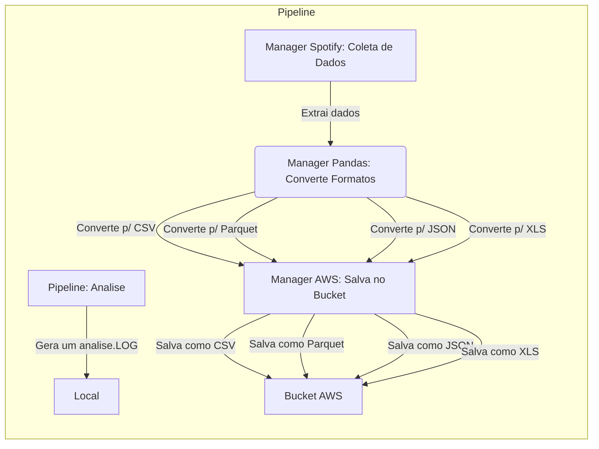

# Doc Datalake Format Explorer

## Descrição

O projeto consiste em coletar dados de uma API do Spotify, transformar os dados em diferentes formatos e armazenar em um bucket na AWS.

## Fluxo

## Módulos do manager_spotify

### ::: app.ETL.manager_spotify.get_spotify_access_token

### ::: app.ETL.manager_spotify.search_artist

### ::: app.ETL.manager_spotify.get_artist_albums

### ::: app.ETL.manager_spotify.get_album_tracks

### ::: app.ETL.manager_spotify.get_all_artist_details

### ::: app.ETL.manager_spotify.get_all_artist_details

## Módulos do manager_polars

### ::: app.ETL.manager_polars.save_data_to_formats

## Módulos do manager_aws

### ::: app.ETL.manager_aws.create_bucket

### ::: app.ETL.manager_aws.upload_to_s3

## Módulos de análise

### ::: app.pipeline.analyze_file_sizes

